---
## Front matter
lang: ru-RU
title: Лабораторная работа № 2
author:
  - Соболевский Денис Андреевич
group:
  - НФИбд-02-20, 1032201668
date: 2023, Москва

## i18n babel
babel-lang: russian
babel-otherlangs: english

## Formatting pdf
toc: false
toc-title: Содержание
slide_level: 2
aspectratio: 169
section-titles: true
theme: metropolis
header-includes:
  - \metroset{progressbar=frametitle,sectionpage=progressbar,numbering=fraction}
  - '\makeatletter'
  - '\beamer@ignorenonframefalse'
  - '\makeatother'
---

## Цели

Целью данной работы является получение практических навыков работы в консоли с атрибутами файлов, закрепление теоретических основ дискреционного разграничения доступа в современных системах с открытым кодом на базе ОС Linux.

## Задачи

1. Создать новую учетную запись guest.

2. Выполнить ряд операций в новой учетной записи.

3. Сформировать таблицу "Установленные права и разрешенные действия".

4. Сформировать таблицу "Минимальные права для совершения операций".

## Ход работы

Создадим учетную запись пользователя guest и зададим пароль.

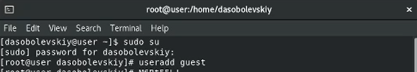

## Ход работы

Войдем в систему от имени пользователя guest

Определим директорию, в которой мы находимся.

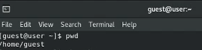

Директория является домашней.

## Ход работы

Уточним имя пользователя.

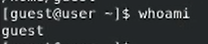

## Ход работы

Уточним имя пользователя, его группу, а также группы, куда входит пользователь.

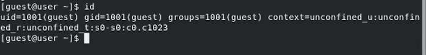

Имя пользователя совпадает с приглашением в командной строке.

## Ход работы

Просмотрим файл /etc/passwd.

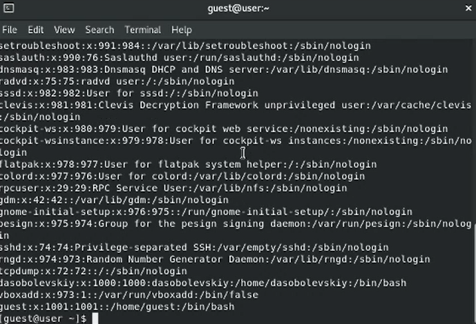

## Ход работы

Найдем в нём свою учётную запись.

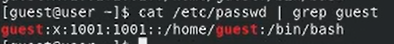

uid = 1001, gid = 1001. Совпадают со значениями, найденными в предыдущих пунктах.

## Ход работы

Определим существующие в системе директории.

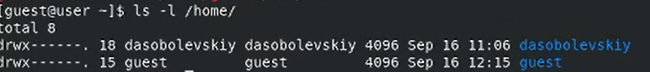

Удалось получить список поддиректорий директории /home. На обеих директориях установлены права drwx------.

## Ход работы

Проверим, какие расширенные атрибуты установлены на поддиректориях, находящихся в директории /home.

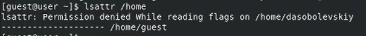

Удалось увидеть расширенные атрибуты директории текущего пользователя, но не удалось увидеть атрибуты директории другого пользователя.

## Ход работы

Создадим в домашней директории поддиректорию dir1 и выведем права доступа и расширенные атрибуты.

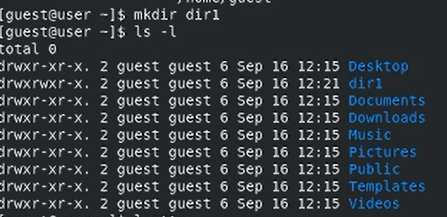

## Ход работы

Снимем с директории dir1 все атрибуты.

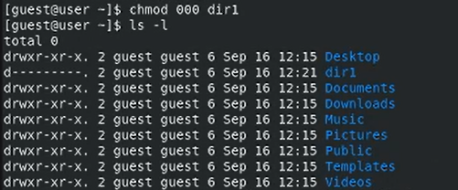

## Ход работы

Попытаемся создать в директории dir1 файл file1.

Мы получили отказ, так как у нас нет прав на создание. Из-за этого файл не был создан.

## Ход работы

Заполним таблицу «Установленные права и разрешённые действия».

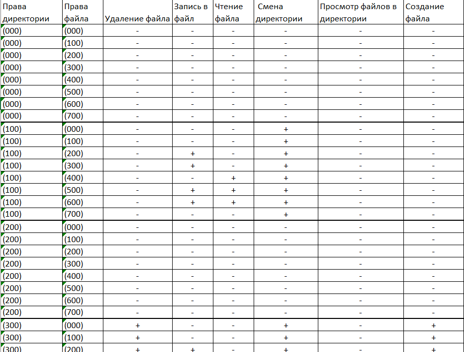

## Ход работы

Заполним таблицу «Минимальные права для совершения операций».

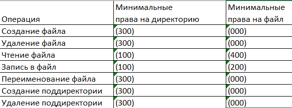

## Результаты

В данной лабораторной работе были изучены средства ограничения прав для отдельных учетных записей.
