---
## Front matter
title: "Лабораторная работа № 2"
subtitle: "Дискреционное разграничение прав в Linux. Основные атрибуты"
author: "Соболевский Денис Андреевич"

## Generic otions
lang: ru-RU
toc-title: "Содержание"

## Bibliography
bibliography: bib/cite.bib
csl: pandoc/csl/gost-r-7-0-5-2008-numeric.csl

## Pdf output format
toc: true # Table of contents
toc-depth: 2
lof: true # List of figures
lot: false
fontsize: 12pt
linestretch: 1.5
papersize: a4
documentclass: scrreprt
## I18n polyglossia
polyglossia-lang:
  name: russian
  options:
	- spelling=modern
	- babelshorthands=true
polyglossia-otherlangs:
  name: english
## I18n babel
babel-lang: russian
babel-otherlangs: english
## Fonts
mainfont: PT Serif
romanfont: PT Serif
sansfont: PT Sans
monofont: PT Mono
mainfontoptions: Ligatures=TeX
romanfontoptions: Ligatures=TeX
sansfontoptions: Ligatures=TeX,Scale=MatchLowercase
monofontoptions: Scale=MatchLowercase,Scale=0.9
## Biblatex
biblatex: true
biblio-style: "gost-numeric"
biblatexoptions:
  - parentracker=true
  - backend=biber
  - hyperref=auto
  - language=auto
  - autolang=other*
  - citestyle=gost-numeric
## Pandoc-crossref LaTeX customization
figureTitle: "Рис."
tableTitle: "Таблица"
listingTitle: "Листинг"
lofTitle: "Список иллюстраций"
lotTitle: "Список таблиц"
lolTitle: "Листинги"
## Misc options
indent: true
header-includes:
  - \usepackage{indentfirst}
  - \usepackage{float} # keep figures where there are in the text
  - \floatplacement{figure}{H} # keep figures where there are in the text
---

# Цель работы

Целью данной работы является получение практических навыков работы в консоли с атрибутами файлов, закрепление теоретических основ дискреционного разграничения доступа в современных системах с открытым кодом на базе ОС Linux.

# Задание

1. Создать новую учетную запись guest.

2. Выполнить операции в новой учетной записи.

3. Сформировать таблицу "Установленные права и разрешенные действия".

4. Сформировать таблицу "Минимальные права для совершения операций".

# Теоретическое введение

- Операционная система — это комплекс программ, предназначенных для управления ресурсами компьютера и организации взаимодействия с пользователем.

- Права доступа определяют, какие действия конкретный пользователь может или не может совершать с определенным файлами и каталогами. С помощью разрешений можно создать надежную среду — такую, в которой никто не может поменять содержимое ваших документов или повредить системные файлы.

# Выполнение лабораторной работы

1. В установленной при выполнении предыдущей лабораторной работы
   операционной системе создайте учётную запись пользователя guest (использую учётную запись администратора):

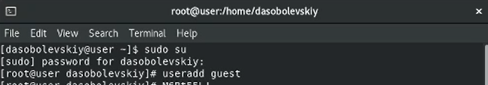

2. Войдем в систему от имени пользователя guest

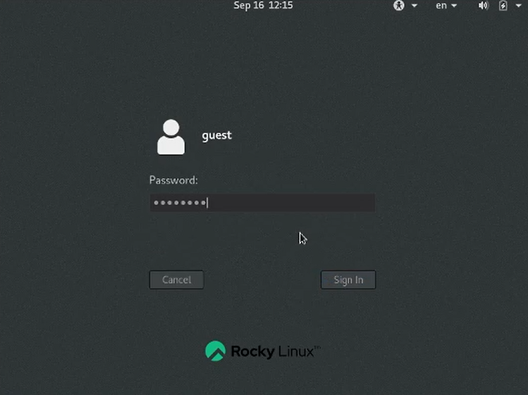

3. Определим директорию, в которой мы находимся.

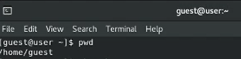

Мы находимся в домашней директории.

4. Уточним имя пользователя командой whoami.

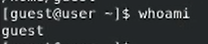

5. Уточним имя пользователя, его группу, а также группы, куда входит пользователь.

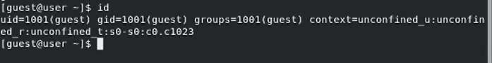

Имя пользователя совпадает с приглашением в командной строке.

6. Просмотрим файл /etc/passwd.

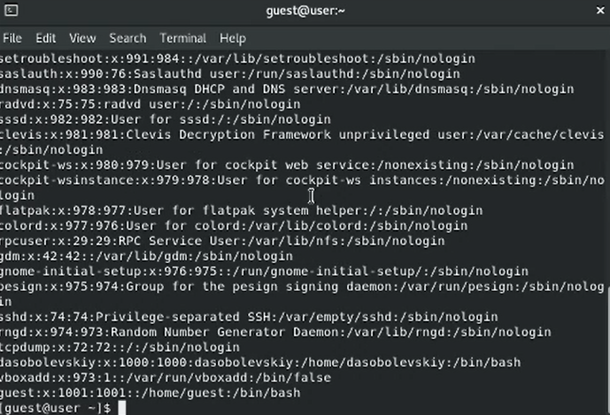

Найдем в нём свою учётную запись.

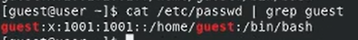

uid = 1001, gid = 1001. Совпадают со значениями, полученными в предыдущих пунктах.

7. Определим существующие в системе директории.

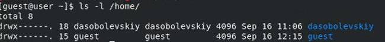

Получили список поддиректорий директории /home. На обеих директориях установлены права drwx------.

8. Проверим, какие расширенные атрибуты установлены на поддиректориях, находящихся в директории /home.

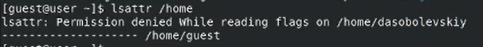

Удалось увидеть расширенные атрибуты директории текущего пользователя. Не удалось увидеть атрибуты директории другого пользователя.

9. Создадим в домашней директории поддиректорию dir1 и выведем права доступа и расширенные атрибуты.

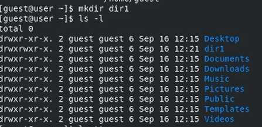

10. Снимем с директории dir1 все атрибуты командой chmod 000 dir1.

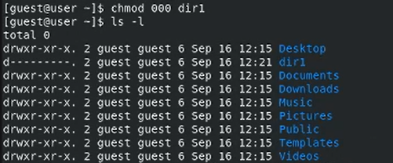

11. Попытаемся создать в директории dir1 файл file1.

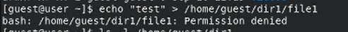

Мы получили отказ, так как у нас нет прав на создание. Из-за этого файл не был создан.

12. Заполним таблицу «Установленные права и разрешённые действия».

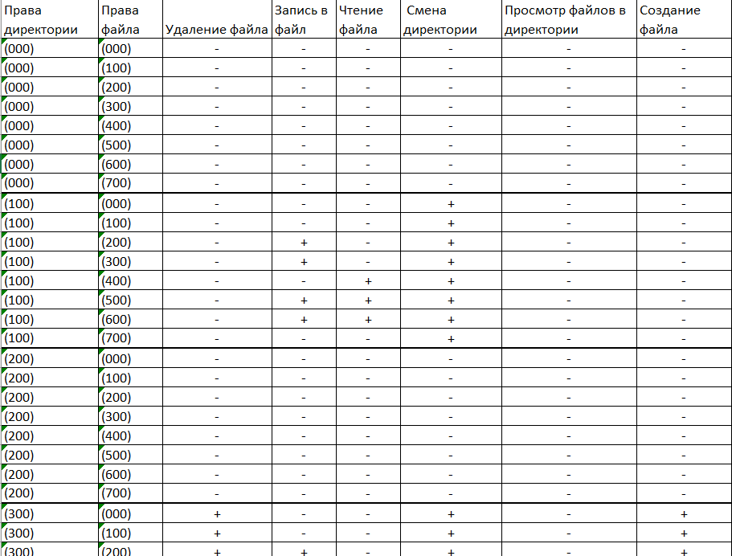

13. Заполним таблицу «Минимальные права для совершения операций».

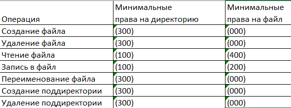

# Выводы

В данной лабораторной работе были изучены средства ограничения прав для отдельных учетных записей.

# Список литературы{.unnumbered}

[1] https://codeby.school/blog/informacionnaya-bezopasnost/razgranichenie-dostupa-v-linux-znakomstvo-s-astra-linux

[2] https://wiki.astralinux.ru/kb/diskretsionnye-i-mandatnye-razgranicheniya-dostupa-k-resursu-samba-158603114.html
