## Цели

Целью данной работы является получение практических навыков работы в консоли с атрибутами файлов для групп пользователей.

## Задачи

1. Создать новую учетную запись guest2.

2. Выполнить ряд операций в новой и старой учетных записях.

3. Сформировать таблицу "Установленные права и разрешенные действия".

4. Сформировать таблицу "Минимальные права для совершения операций".

## Ход работы

Создадим учетную запись пользователя guest2 и зададим пароль.

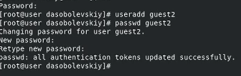{#fig:001 width=90%}

## Ход работы

Добавим пользователя guest2 в группу guest.

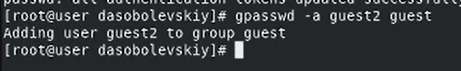{#fig:002 width=90%}

## Ход работы

Осуществим вход в систему от двух пользователей на двух разных консолях.

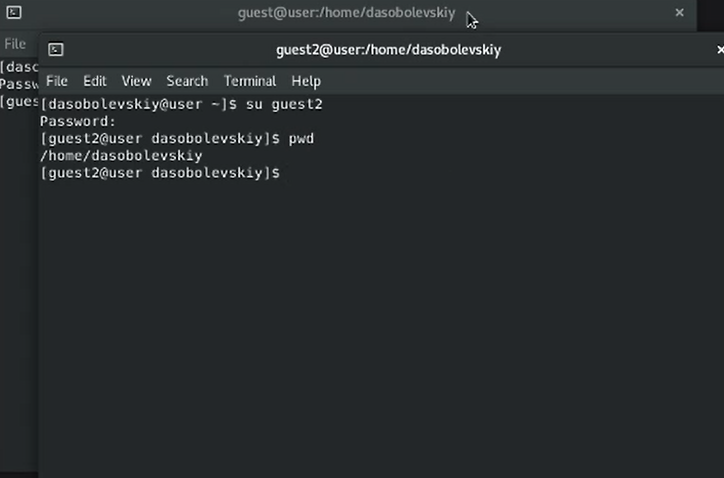{#fig:003 width=50%}

## Ход работы

Для обоих пользователей командой pwd определим директорию, в которой мы находимся. Видим, что приглашение в командной строке соответствует.

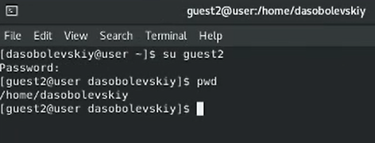{#fig:004 width=90%}

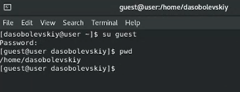{#fig:005 width=90%}

## Ход работы

Уточним имя пользователя, его группу, кто входит в неё и к каким группам принадлежит он сам.

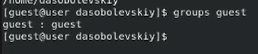{#fig:006 width=40%}

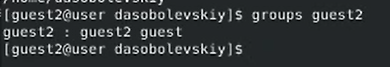{#fig:007 width=40%}

Заметим, что все команды выводят одинаковую информацию, но в разных форматах

## Ход работы

Сравним полученную информацию с содержимым файла /etc/group.

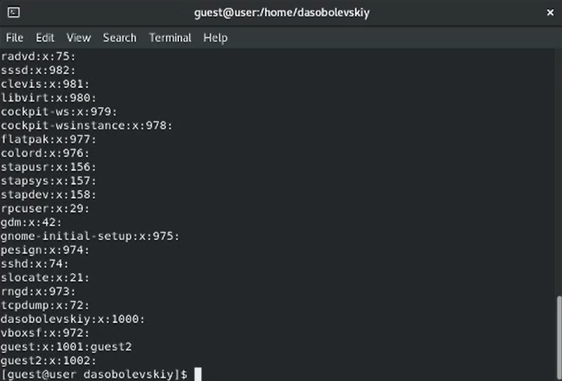{#fig:008 width=20%}

Видим информацию о группе, ее id и название подгруппы.

## Ход работы

От имени пользователя guest2 выполним регистрацию пользователя guest2 в группе guest

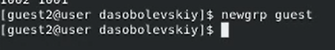{#fig:009 width=90%}

## Ход работы

От имени пользователя guest изменим права директории /home/guest, разрешив все действия для пользователей группы

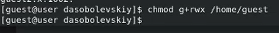{#fig:010 width=90%}

## Ход работы

От имени пользователя guest снимем с директории /home/guest/dir1 все атрибуты

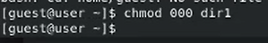{#fig:011 width=90%}

## Ход работы

Заполним таблицу «Установленные права и разрешённые действия».

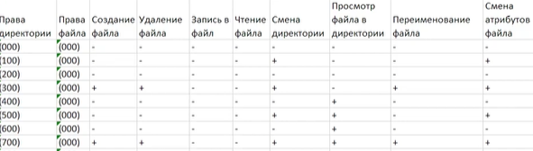{#fig:012 width=90%}

## Ход работы

Заполним таблицу «Минимальные права для совершения операций».

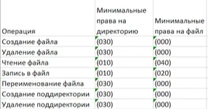{#fig:013 width=50%}

## Результаты

В ходе данной лабораторной работы были получены практические навыки работы в консоли с атрибутами файлов для групп пользователей.
