# Цель работы

Целью данной работы является получение практических навыков работы в консоли с атрибутами файлов для групп пользователей.

# Задание

1. Создать новую учетную запись guest2.

2. Выполнить ряд операций в новой и старой учетных записях.

3. Сформировать таблицу "Установленные права и разрешенные действия".

4. Сформировать таблицу "Минимальные права для совершения операций".

# Теоретическое введение

- Операционная система — это комплекс программ, предназначенных для управления ресурсами компьютера и организации взаимодействия с пользователем.

- Права доступа определяют, какие действия конкретный пользователь может или не может совершать с определенным файлами и каталогами. С помощью разрешений можно создать надежную среду — такую, в которой никто не может поменять содержимое ваших документов или повредить системные файлы.

# Выполнение лабораторной работы

1. Первые два пункта были выполнены в предыдущей лабораторной работе. Создаем учетную запись guest2.

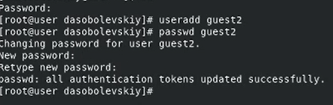

2. Добавим пользователя guest2 в группу guest.

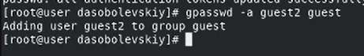

3. Войдем в учетные записи с разных консолей.

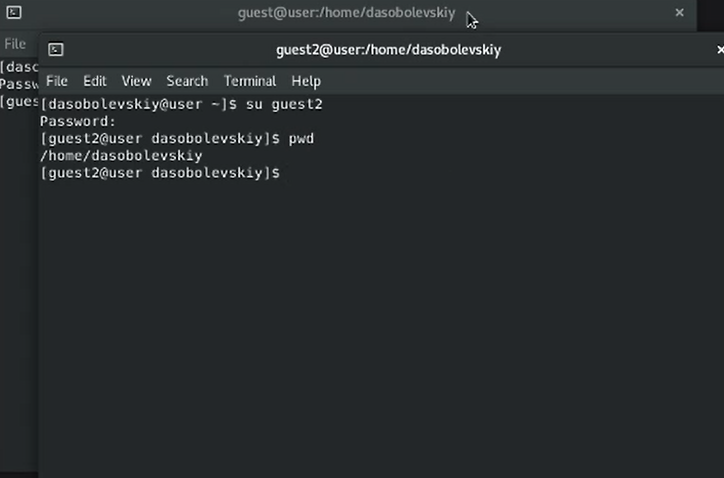

4. Для обоих пользователей командой pwd определим директорию, в которой мы находимся. Приглашение в командной строке соответствует.

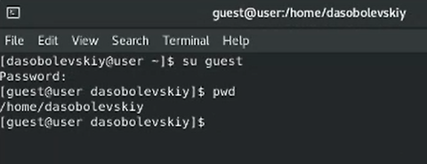

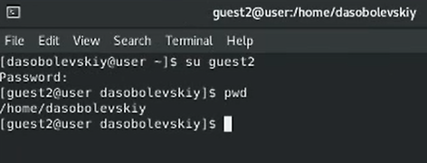

5. Уточним имя пользователя, его группу, кто входит в неё и к каким группам принадлежит он сам.

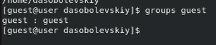

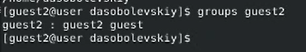

Все команды выводят одну и ту же информацию в разных форматах.

6. Сравним полученную информацию с содержимым файла /etc/group.

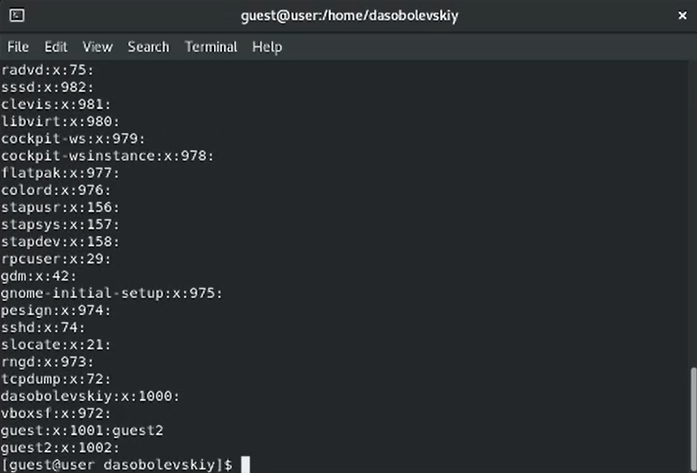

Отображается группа, ее id и название подгруппы.

7. От имени пользователя guest2 выполним регистрацию пользователя guest2 в группе guest.

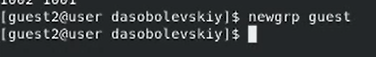

8. От имени пользователя guest изменим права директории /home/guest, разрешив все действия для пользователей группы.

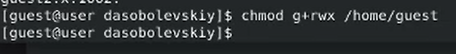

9. От имени пользователя guest снимем с директории /home/guest/dir1 все атрибуты командой chmod 000 dir1.

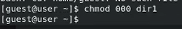

10. Заполним первую таблицу.

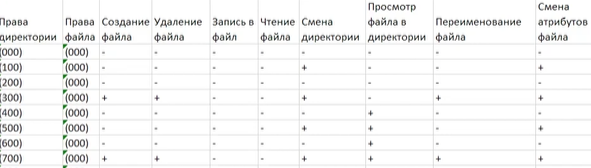

11. Заполним вторую таблицу.

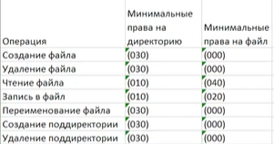

# Выводы

В ходе лабораторной работы были получены практические навыки работы в консоли с атрибутами файлов для групп пользователей.

# Список литературы{.unnumbered}

[1] https://codeby.school/blog/informacionnaya-bezopasnost/razgranichenie-dostupa-v-linux-znakomstvo-s-astra-linux

[2] https://debianinstall.ru/diskretsionnoe-razgranichenie-dostupa-linux/
