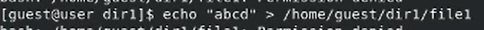

## Цели

Целью данной работы является получение практических навыков работы в консоли с расширенными атрибутами файлов.

## Задачи

1. Исследовать доступность команд при установленном расширенном aтрибуте a.

2. Исследовать доступность команд при установленном расширенном aтрибуте i.

## Ход работы

От имени пользователя guest определим расширенные атрибуты файла /home/guest/dir1/file1.

## Ход работы

Установим командой chmod 600 file1 на файл file1 права, разрешающие чтение и запись для владельца файла.

## Ход работы

Попробуем установить на файл /home/guest/dir1/file1 расширенный атрибут "a" от имени пользователя guest.

## Ход работы

Откроем вторую консоль с правами администратора. Установим на файл /home/guest/dir1/file1 расширенный атрибут a.

## Ход работы

Проверим правильно ли установлен атрибут.

## Ход работы

Дозапишем в файл file1 слова «test» и выполним чтение файла file1.

## Ход работы

Попробуем стереть имеющуюся в файле информацию.

## Ход работы

Попробуем установить на файл file1 права, запрещающие чтение и запись для владельца файла.

## Ход работы

Снимем расширенный атрибут a с файла /home/guest/dirl/file1 от
имени суперпользователя.

## Ход работы

Повторим операции, которые нам ранее не удавалось выполнить. Теперь все операции выполняются.

## Ход работы

Меняем атрибут "a" на "i" и повторяем действия.

## Ход работы

## Результаты

В данной лабораторной работе были получены практические навыки работы в консоли с расширенными атрибутами файлов.
