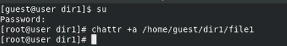
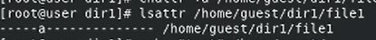
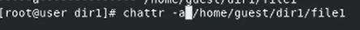
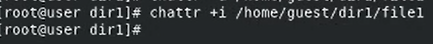

# Цель работы

Целью данной работы является получение практических навыков работы в консоли с расширенными атрибутами файлов.

# Задание

1. Исследовать доступность команд при установленном расширенном aтрибуте a.

2. Исследовать доступность команд при установленном расширенном aтрибуте i.

# Теоретическое введение

- Операционная система — это комплекс программ, предназначенных для управления ресурсами компьютера и организации взаимодействия с пользователем.

- Права доступа определяют, какие действия конкретный пользователь может или не может совершать с определенным файлами и каталогами. С помощью разрешений можно создать надежную среду — такую, в которой никто не может поменять содержимое ваших документов или повредить системные файлы.

# Выполнение лабораторной работы

1. От имени пользователя guest определим расширенные атрибуты файла /home/guest/dir1/file1.

2. Установим командой chmod 600 file1 на файл file1 права, разрешающие чтение и запись для владельца файла.

3. Попробуем установить на файл /home/guest/dir1/file1 расширенный атрибут "a" от имени пользователя guest.

4. Откроем вторую консоль с правами администратора. Установим на файл /home/guest/dir1/file1 расширенный атрибут a.

5. Проверим правильно ли установлен атрибут.

6. Дозапишем в файл file1 слова «test» и выполним чтение файла file1.

7. Попробуем стереть имеющуюся в файле информацию.

8. Попробуем установить на файл file1 права, запрещающие чтение и запись для владельца файла.

9. Снимем расширенный атрибут a с файла /home/guest/dirl/file1 от
   имени суперпользователя.

10. Повторим операции, которые нам ранее не удавалось выполнить. Теперь все операции выполняются.

11. Меняем атрибут "a" на "i" и повторяем действия.

# Выводы

В данной лабораторной работе были получены практические навыки работы с расширенными атрибутами файлов.

# Список литературы

[1] https://codeby.school/blog/informacionnaya-bezopasnost/razgranichenie-dostupa-v-linux-znakomstvo-s-astra-linux

[2] https://debianinstall.ru/diskretsionnoe-razgranichenie-dostupa-linux/
