## Цели

Изучение механизмов изменения идентификаторов, применения
SetUID- и Sticky-битов. Получение практических навыков работы в консоли с дополнительными атрибутами. Рассмотрение работы механизма
смены идентификатора процессов пользователей, а также влияние бита
Sticky на запись и удаление файлов.

## Задачи

1. Исследовать влияние дополнительных атрибутов.

2. Исследовать Sticky-бит.

## Ход работы

От имени пользователя guest создадим программу simpleid.c, скомпилируем ее и убедимся, что файл программы создан.

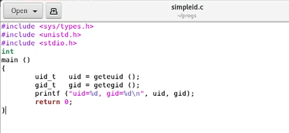.

## Ход работы

Выполним команды ./simpleid и id и убедимся, что полученные данные совпадают.

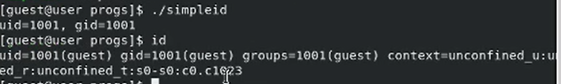

## Ход работы

Усложним программу, добавив вывод действительных индентификаторов.

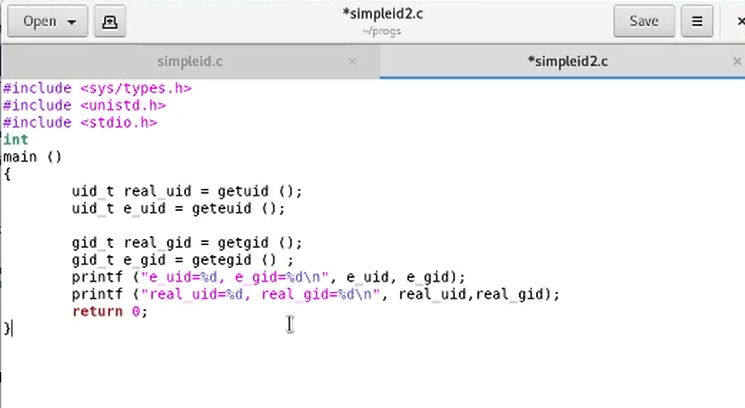

## Ход работы

От имени суперпользователя выполним команды.

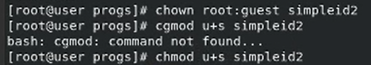

## Ход работы

Выполним команды ./simpleid2 и id и убедимся, что полученные данные совпадают.

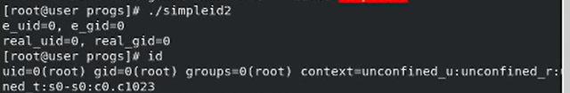

## Ход работы

Выполним проверку правильности установки новых атрибутов.

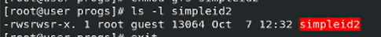

## Ход работы

Создадим и скомпилируем программу readfile.c.

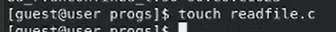

## Ход работы

Сменим владельца у файла readfile.c и изменим права так, чтобы только суперпользователь (root) мог прочитать его, a guest не мог.

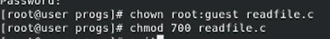

## Ход работы

Проверим, что пользователь guest не может прочитать файл readfile.c.

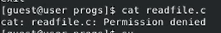

## Ход работы

Сменим владельца и установим SetUID-бит.

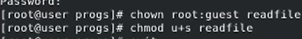

## Ход работы

Проверим, может ли программа readfile прочитать файл readfile.c.

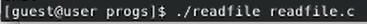

## Ход работы

Проверим, может ли программа readfile прочитать файл /etc/shadow.

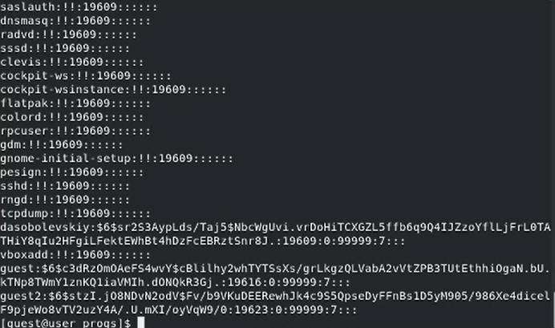

## Ход работы

Выясним, установлен ли атрибут Sticky на директории /tmp.

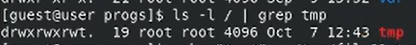

## Ход работы

От имени пользователя guest создадим файл file01.txt в директории /tmp.

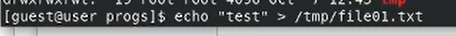

## Ход работы

От пользователя guest2 попробуем прочитать файл file01.txt.

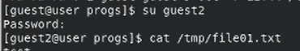

## Ход работы

От пользователя guest2 попробуем дозаписать файл file01.txt.

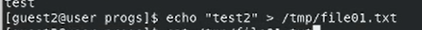

## Ход работы

От пользователя guest2 попробуем записать в файл file01.txt слово test3, стерев при этом всю имеющуюся в файле информацию.

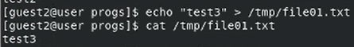

## Ход работы

От пользователя guest2 попробуем удалить файл file01.txt.

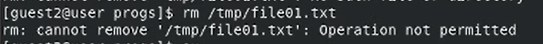

## Ход работы

От имени суперпользователя снимем атрибут t с директории /tmp..

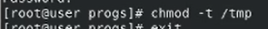

## Ход работы

Повторим предыдущие шаги. Теперь файл удален успешно.

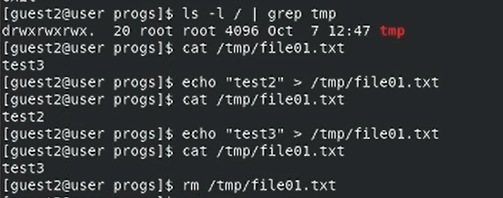

## Ход работы

Повысим свои права до суперпользователя и вернем атрибут t на директорию /tmp.

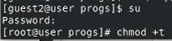

## Результаты

В рамках данной лабораторной работы были изучены механизмы изменения идентификаторов, применения SetUID- и Sticky-битов. Получены практические навыков работы в консоли с дополнительными атрибутами. Рассмотрены принципы работы механизма
смены идентификатора процессов пользователей, а также влияние бита
Sticky на запись и удаление файлов.
