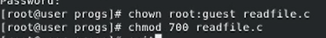

# Цель работы

Изучение механизмов изменения идентификаторов, применения
SetUID- и Sticky-битов. Получение практических навыков работы в консоли с дополнительными атрибутами. Рассмотрение работы механизма
смены идентификатора процессов пользователей, а также влияние бита
Sticky на запись и удаление файлов.

# Задание

1. Исследовать влияние дополнительных атрибутов.

2. Исследовать Sticky-бит.

# Теоретическое введение

- Операционная система — это комплекс программ, предназначенных для управления ресурсами компьютера и организации взаимодействия с пользователем.

- Права доступа определяют, какие действия конкретный пользователь может или не может совершать с определенным файлами и каталогами. С помощью разрешений можно создать надежную среду — такую, в которой никто не может поменять содержимое ваших документов или повредить системные файлы.

# Выполнение лабораторной работы

1. От имени пользователя guest создадим программу simpleid.c, скомпилируем ее и убедимся, что файл программы создан.

.

2. Выполним команды ./simpleid и id и убедимся, что полученные данные совпадают.

3. Усложним программу, добавив вывод действительных индентификаторов.

4. От имени суперпользователя выполним команды.

5. Выполним команды ./simpleid2 и id и убедимся, что полученные данные совпадают.

6. Выполним проверку правильности установки новых атрибутов.

7. Создадим и скомпилируем программу readfile.c.

8. Сменим владельца у файла readfile.c и изменим права так, чтобы только суперпользователь (root) мог прочитать его, a guest не мог.

9. Проверим, что пользователь guest не может прочитать файл readfile.c.

10. Сменим владельца и установим SetUID-бит.

11. Проверим, может ли программа readfile прочитать файл readfile.c.

12. Проверим, может ли программа readfile прочитать файл /etc/shadow.

13. Выясним, установлен ли атрибут Sticky на директории /tmp.

14. От имени пользователя guest создадим файл file01.txt в директории /tmp.

15. От пользователя guest2 попробуем прочитать файл file01.txt.

16. От пользователя guest2 попробуем дозаписать файл file01.txt.

17. От пользователя guest2 попробуем записать в файл file01.txt слово test3, стерев при этом всю имеющуюся в файле информацию.

18. От пользователя guest2 попробуем удалить файл file01.txt.

19. От имени суперпользователя снимем атрибут t с директории /tmp..

20. Повторим предыдущие шаги. Теперь файл удален успешно.

21. Повысим свои права до суперпользователя и вернем атрибут t на директорию /tmp.

# Выводы

В рамках данной лабораторной работы были изучены механизмы изменения идентификаторов, применения SetUID- и Sticky-битов. Получены практические навыков работы в консоли с дополнительными атрибутами. Рассмотрены принципы работы механизма смены идентификатора процессов пользователей, а также влияние бита
Sticky на запись и удаление файлов.

# Список литературы

[1] https://codeby.school/blog/informacionnaya-bezopasnost/razgranichenie-dostupa-v-linux-znakomstvo-s-astra-linux

[2] https://www.researchgate.net/profile/Dmitry-Kulyabov/publication/339290917_Informacionnaa_bezopasnost_komputernyh_setej_laboratornye_raboty/links/5e482028299bf1cdb92e26d4/Informacionnaa-bezopasnost-komputernyh-setej-laboratornye-raboty.pdf
