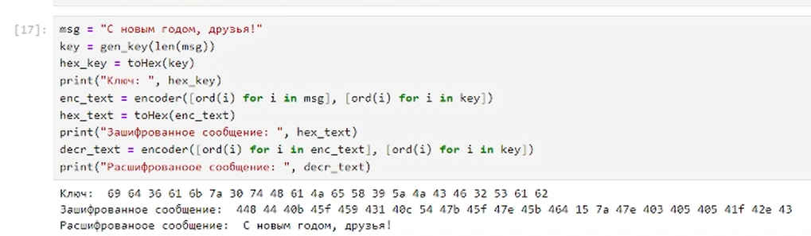

## Цели

Освоить на практике применение режима однократного гаммирования.

## Задачи

Нужно подобрать ключ, чтобы получить сообщение «С Новым Годом,
друзья!». Требуется разработать приложение, позволяющее шифровать и
дешифровать данные в режиме однократного гаммирования. Приложение
должно:

1. Определить вид шифротекста при известном ключе и известном открытом тексте.
2. Определить ключ, с помощью которого шифротекст может быть преобразован в некоторый фрагмент текста, представляющий собой один из
   возможных вариантов прочтения открытого текста.

## Ход работы

Импортируем модули.

## Ход работы

Напишем функцию для преобразования данных в шестнадцатеричный формат.

## Ход работы

Напишем функцию для генерации ключа.

## Ход работы

Реализуем функцию для кодирования и декодирования данных.

## Ход работы

Закодируем и декодируем сообщение "С Новым годом, друзья!".

## Ход работы

Получим ключ, с помощью которого получим сообщение "С Новым годом, коллега", вместо "С Новым годом, друзья!" при декодировании. Воспользуемся симметричностью кодирования.

## Результаты

В данной лабораторной работе было освоено на практике применение режима однократного гаммирования.
