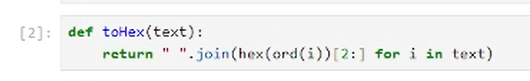
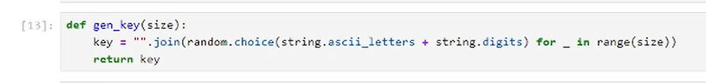
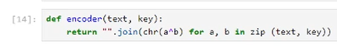
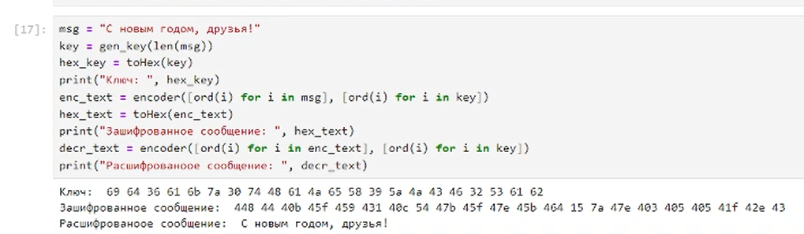
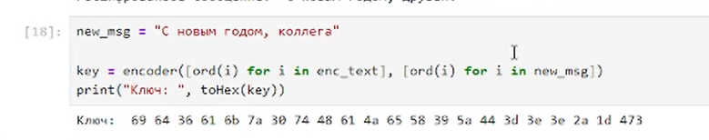

# Цель работы

Освоить на практике применение режима однократного гаммирования.

# Задание

Нужно подобрать ключ, чтобы получить сообщение «С Новым Годом,
друзья!». Требуется разработать приложение, позволяющее шифровать и
дешифровать данные в режиме однократного гаммирования. Приложение
должно:

1. Определить вид шифротекста при известном ключе и известном открытом тексте.
2. Определить ключ, с помощью которого шифротекст может быть преобразован в некоторый фрагмент текста, представляющий собой один из
   возможных вариантов прочтения открытого текста.

# Теоретическое введение

- Шифрование — это процесс кодирования информации с целью предотвращения несанкционированного доступа. В случае кражи или утечки зашифрованные данные будут недоступны для прочтения без соответствующего ключа.

- Гаммирование - преобразование исходного (открытого) текста, при котором символы исходного текста складываются (по модулю, равному мощности алфавита) с символами псевдослучайной последовательности, вырабатываемой по определенному правилу.

# Выполнение лабораторной работы

1. Импортируем модули.

2. Напишем функцию для преобразования данных в шестнадцатеричный формат.

3. Напишем функцию для генерации ключа.

4. Реализуем функцию для кодирования и декодирования данных.

5. Закодируем и декодируем сообщение "С Новым годом, друзья!".

6. Получим ключ, с помощью которого получим сообщение "С Новым годом, коллега", вместо "С Новым годом, друзья!" при декодировании. Воспользуемся симметричностью кодирования.

# Выводы

В данной лабораторной работе было освоено на практике применение режима однократного гаммирования.

# Список литературы{.unnumbered}

[1] https://www.eset.com/ua-ru/support/information/entsiklopediya-ugroz/shifrovaniye/

[2] https://www.finam.ru/publications/item/gammirovanie-20230628-2028/
