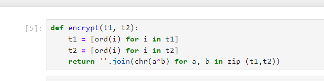
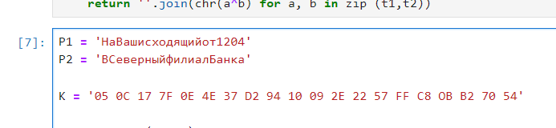
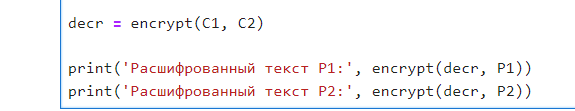
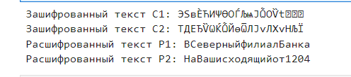

## Цели

Освоить на практике применение режима однократного гаммирования
на примере кодирования различных исходных текстов одним ключом.

## Задачи

Два текста кодируются одним ключом (однократное гаммирование).
Требуется не зная ключа и не стремясь его определить, прочитать оба текста. Необходимо разработать приложение, позволяющее шифровать и дешифровать тексты P1 и P2 в режиме однократного гаммирования. Приложение должно определить вид шифротекстов C1 и C2 обоих текстов P1 и P2 при известном ключе ; Необходимо определить и выразить аналитически способ, при котором злоумышленник может прочитать оба текста, не зная ключа и не стремясь его определить.

## Ход работы

Создадим функцию шифрования.

## Ход работы

Введем данные из условия (@fig:002).

## Ход работы

Зашифруем текст с помощью ключа К.

## Ход работы

Создадим последовательность, с помощью которой будем расшифровывать текст.

## Ход работы

Запустим программу.

## Результаты

В рамках лабораторной работы было освоено на практике применение режима однократного гаммирования на примере кодирования различных исходных текстов одним ключом.
