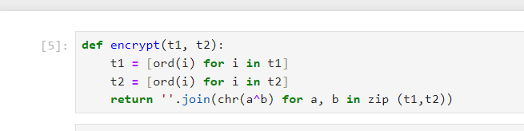
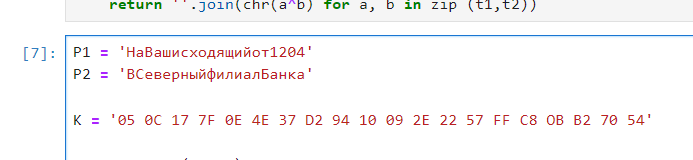
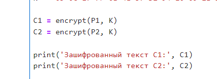
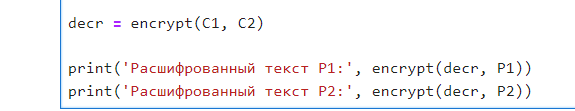
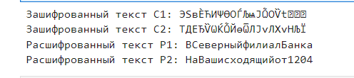

# Цель работы

Освоить на практике применение режима однократного гаммирования
на примере кодирования различных исходных текстов одним ключом.

# Задание

Два текста кодируются одним ключом (однократное гаммирование).
Требуется не зная ключа и не стремясь его определить, прочитать оба текста. Необходимо разработать приложение, позволяющее шифровать и дешифровать тексты P1 и P2 в режиме однократного гаммирования. Приложение должно определить вид шифротекстов C1 и C2 обоих текстов P1 и P2 при известном ключе ; Необходимо определить и выразить аналитически способ, при котором злоумышленник может прочитать оба текста, не зная ключа и не стремясь его определить.

# Теоретическое введение

- Шифрование – это технология кодирования и раскодирования данных.Зашифрованные данные -это результат применения алгоритма для кодирования данных с целью сделать их недоступными для чтения. Данные могут быть раскодированы в исходную форму только путем применения специальный ключа.

- Гаммирование — это наложение (или снятие при расшифровке сообщений) на открытое (или зашифрованное) сообщение так называемой криптографической гаммы. Криптографическая гамма — это последовательность элементов данных, которая вырабатывается с помощью определенного алгоритма.

# Выполнение лабораторной работы

1. Создадим функцию шифрования.

2. Введем данные из условия (@fig:002).

3. Зашифруем текст с помощью ключа К.

4. Создадим последовательность, с помощью которой будем расшифровывать текст.

5. Запустим программу.

# Выводы

В рамках лабораторной работы было освоено на практике применение режима однократного гаммирования на примере кодирования различных исходных текстов одним ключом.

# Список литературы{.unnumbered}

https://www.eset.com/ua-ru/support/information/entsiklopediya-ugroz/shifrovaniye/

https://www.finam.ru/publications/item/gammirovanie-20230628-2028/
